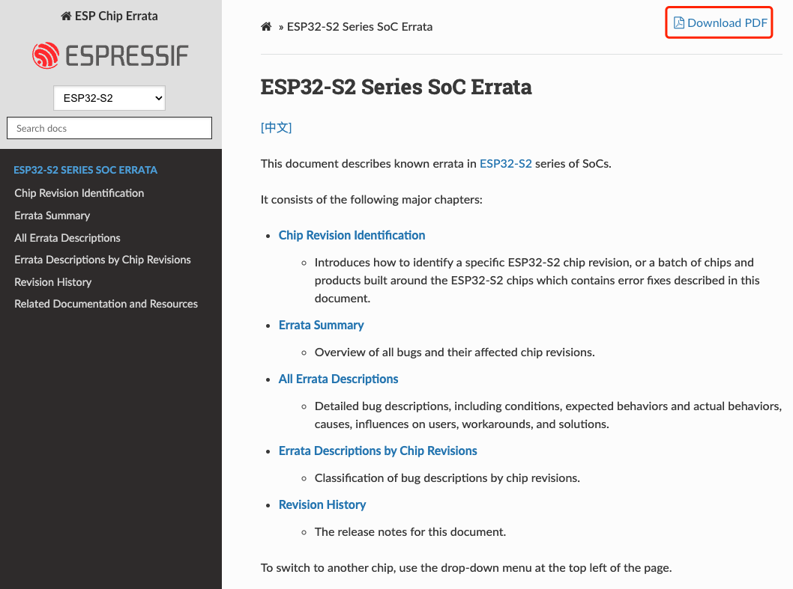
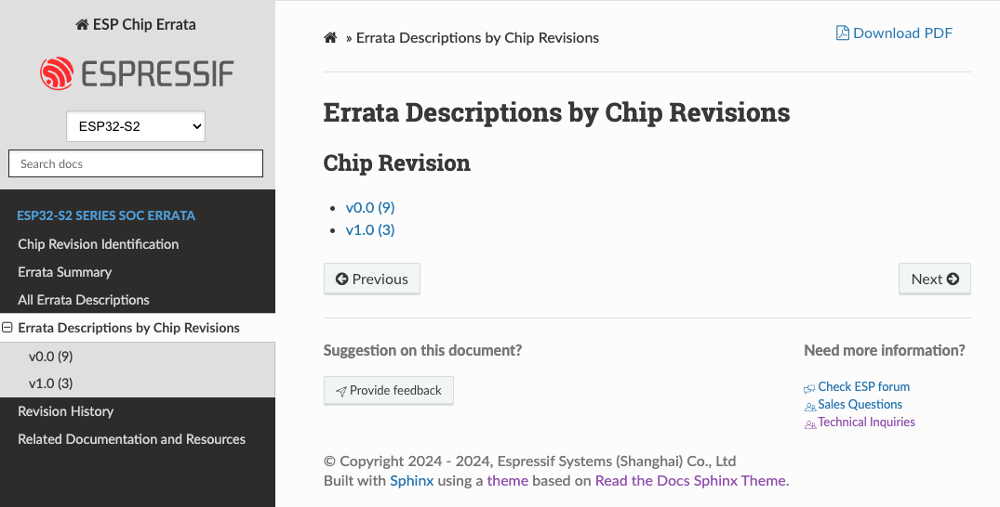

# ESP Chip Errata ([中文](README_CN.md))

The esp-chip-errata repository hosts the following errata, which documents the known errors in SoCs and the solutions to solve the errors:

- [ESP32 Series SoC Errata](https://docs.espressif.com/projects/esp-chip-errata/en/latest/esp32/index.html)
- [ESP32-S2 Series SoC Errata](https://docs.espressif.com/projects/esp-chip-errata/en/latest/esp32s2/index.html)
- [ESP32-C3 Series SoC Errata](https://docs.espressif.com/projects/esp-chip-errata/en/latest/esp32c3/index.html)
- [ESP32-S3 Series SoC Errata](https://docs.espressif.com/projects/esp-chip-errata/en/latest/esp32s3/index.html)
- [ESP32-C2 (ESP8684) Series SoC Errata](https://docs.espressif.com/projects/esp-chip-errata/en/latest/esp32c2/index.html)
- [ESP32-C6 Series SoC Errata](https://docs.espressif.com/projects/esp-chip-errata/en/latest/esp32c6/index.html)
- [ESP32-H2 Series SoC Errata](https://docs.espressif.com/projects/esp-chip-errata/en/latest/esp32h2/index.html)

## Features

The key features of this repository are:
- Multi-format output
    - The errata are available in both **PDF** and **HTML** formats.
    - To get the PDF version, click the "Download PDF" button at the top right corner of the HTML page.
    
- Filter errata descriptions by chip revisions
    - To view errata descriptions for a specific chip revision, navigate to "Errata Descriptions by Chip Revisions" in the sidebar, and select the chip revision.
    - The number in brackets indicates the total number of issues identified for each chip revision.
    

## License

This repository is distributed under multiple licenses:
- All scripts, except [docs/sphinx-tags.py](./docs/sphinx-tags.py), are licensed under the [Apache License 2.0](./LICENSE-APACHE).
- The [docs/sphinx-tags.py](./docs/sphinx-tags.py) script is licensed under the [MIT License](./LICENSE-MIT).
- All documentation is licensed under the [Creative Commons Attribution Share Alike 4.0 International (CC-BY-SA 4.0)](./LICENSE-CC-BY-SA).

## Leave Feedback and Contribute

We welcome community contributions to improve the errata documentation!

If you encounter issues or have suggestions:
- Leave a comment using the "Provide Feedback" button at the bottom of any [HTML documentation page](https://docs.espressif.com/projects/esp-chip-errata/en/latest/esp32c6/index.html).
- Report an issue via [GitHub Issues](https://github.com/espressif/esp-chip-errata/issues).
- Submit a fix via [pull request (PR)](https://github.com/espressif/esp-chip-errata/pulls).
    > For PRs, follow the [contributing guidelines](CONTRIBUTING.md).
