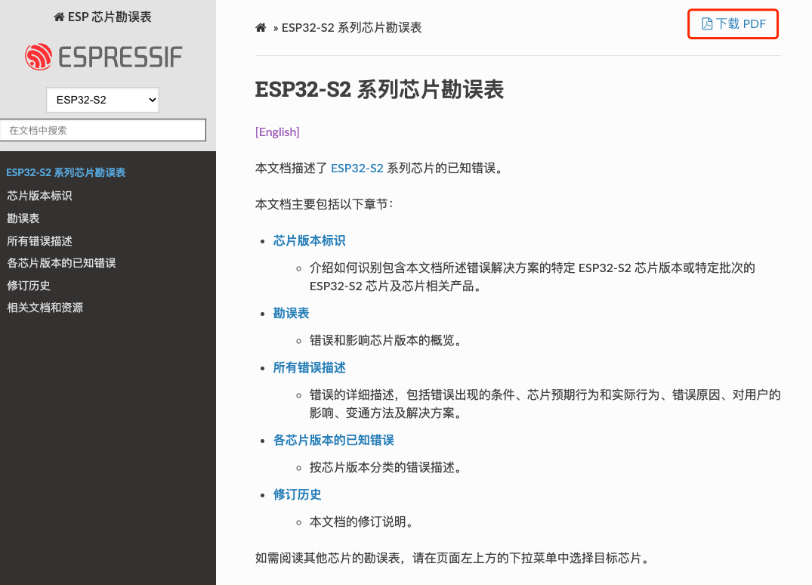
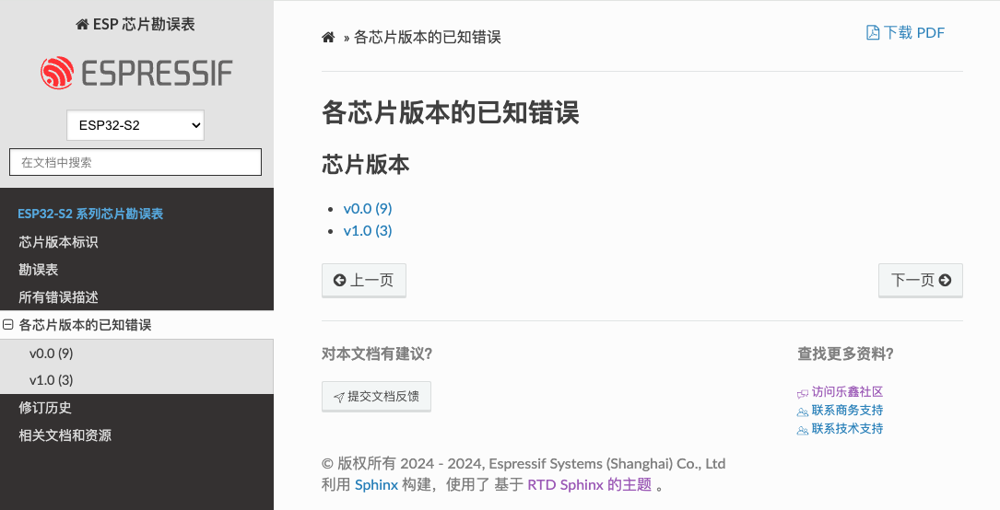

# ESP 芯片勘误表 ([English](README.md))

esp-chip-errata 仓库包含以下勘误表，记录了芯片已知的错误及解决方法：

- [ESP32 系列芯片勘误表](https://docs.espressif.com/projects/esp-chip-errata/zh_CN/latest/esp32/index.html)
- [ESP32-S2 系列芯片勘误表](https://docs.espressif.com/projects/esp-chip-errata/zh_CN/latest/esp32s2/index.html)
- [ESP32-C3 系列芯片勘误表](https://docs.espressif.com/projects/esp-chip-errata/zh_CN/latest/esp32c3/index.html)
- [ESP32-S3 系列芯片勘误表](https://docs.espressif.com/projects/esp-chip-errata/zh_CN/latest/esp32s3/index.html)
- [ESP32-C2 (ESP8684) 系列芯片勘误表](https://docs.espressif.com/projects/esp-chip-errata/zh_CN/latest/esp32c2/index.html)
- [ESP32-C6 系列芯片勘误表](https://docs.espressif.com/projects/esp-chip-errata/zh_CN/latest/esp32c6/index.html)
- [ESP32-H2 系列芯片勘误表](https://docs.espressif.com/projects/esp-chip-errata/zh_CN/latest/esp32h2/index.html)
- [ESP32-P4 系列芯片勘误表](https://docs.espressif.com/projects/esp-chip-errata/zh_CN/latest/esp32p4/index.html)
- [ESP32-S31 系列芯片勘误表](https://docs.espressif.com/projects/esp-chip-errata/zh_CN/latest/esp32s31/index.html)

## 功能特性

本仓库的主要功能如下：
- 多格式输出
    - 勘误表提供 **PDF** 和 **HTML** 两种格式。
    - 如需 PDF 格式，请点击 HTML 页面右上角的 "下载 PDF" 图标。
    
- 按芯片版本筛选错误描述
    - 如需查看特定芯片版本的错误描述，请在侧边栏中找到 "各芯片版本的已知错误"，然后选择芯片版本。
    - 括号中的数字表示每个芯片版本已知的错误数量。
    

## 开源许可说明

本仓库采用多种许可协议：
- 除 [docs/sphinx-tags.py](./docs/sphinx-tags.py) 脚本外，所有代码文件均适用 [Apache License 2.0](./LICENSE-APACHE)。
- [docs/sphinx-tags.py](./docs/sphinx-tags.py) 脚本单独采用 [MIT License](./LICENSE-MIT)。
- 所有文档均适用 [署名—相同方式共享 4.0 协议国际版 (CC-BY-SA 4.0)](./LICENSE-CC-BY-SA)。

## 问题反馈与贡献指引

诚邀社区开发者共同完善勘误表文档！

如果发现问题或有改进建议，您可以：
- 点击任意 [HTML 文档页面](https://docs.espressif.com/projects/esp-chip-errata/zh_CN/latest/esp32c6/index.html) 底部 “提交文档反馈” 图标留言。
- 通过 [GitHub Issues](https://github.com/espressif/esp-chip-errata/issues) 报告问题。
- 直接提交 [Pull Request (PR)](https://github.com/espressif/esp-chip-errata/pulls) 修复。
    > 提交 PR 时，请遵循 [贡献指南](CONTRIBUTING.md)。
